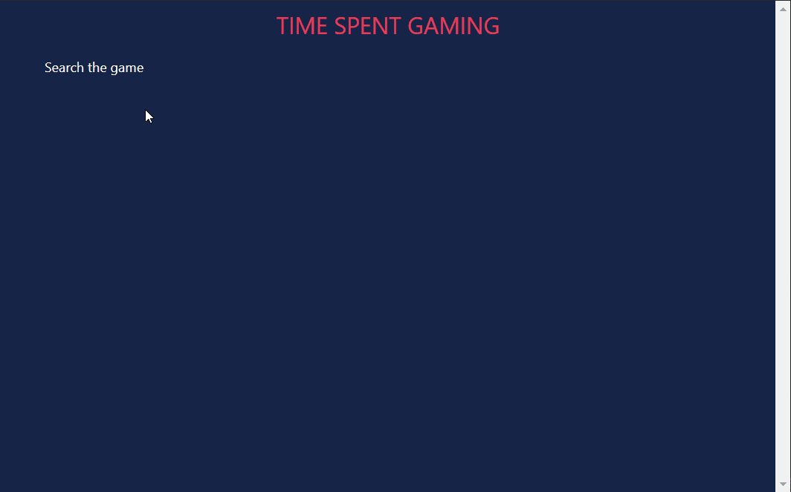

# Gameplay Time Calculator React

This is a simple web application to calculate the amount of time a user has spent playing video games. The user can search for a game and fetch the average game time from the How Long To Beat database where other rplayers have submitted there average times to beat a game.

The demo can be viewed here: [Gameplay Time Calculator React](https://time-spent-gaming.netlify.app)

## Other Packages Used

1. [howlongtobeat](https://www.npmjs.com/package/howlongtobeat): Used to get average gameplay times of various play types submitted by players to the "How Long To Beat" website. **Note:** The package may have to be modified to for making requests with CORS support.

## Preview

## Available Scripts

In the project directory, you can run:

### `npm start`

Runs the app in the development mode.\
Open [http://localhost:3000](http://localhost:3000) to view it in the browser.

The page will reload if you make edits.\
You will also see any lint errors in the console.

### `npm run build`

Builds the app for production to the `build` folder.\
It correctly bundles React in production mode and optimizes the build for the best performance.

The build is minified and the filenames include the hashes.\
Your app is ready to be deployed!

See the section about [deployment](https://facebook.github.io/create-react-app/docs/deployment) for more information.